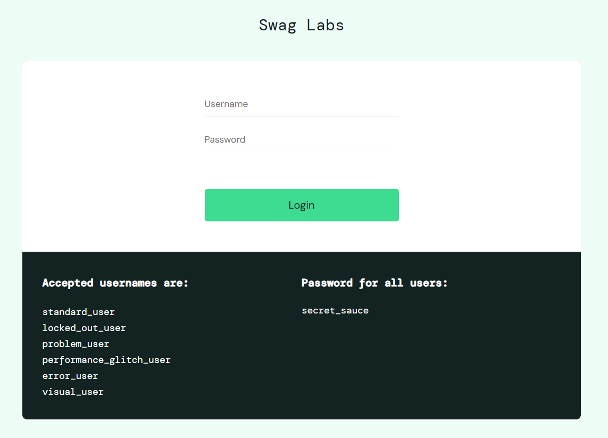
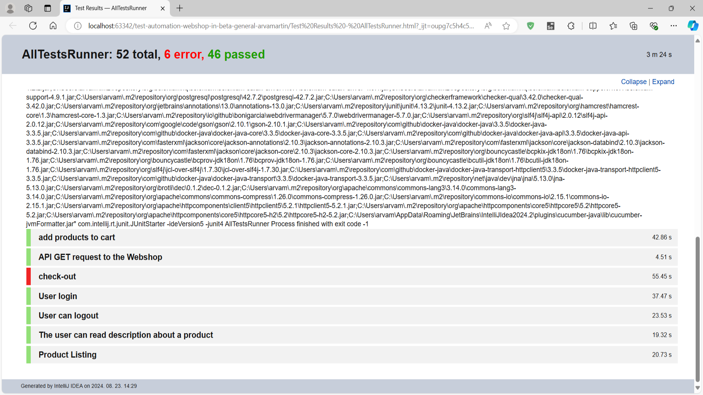
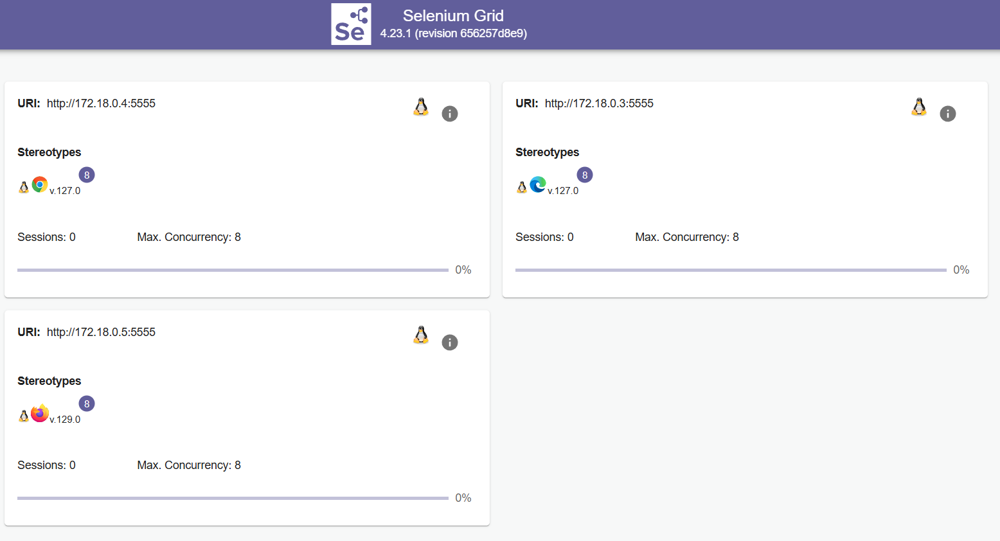

# Webshop in Beta (Selenium Grid Project)

# System Under Test (SUT)
;

# Test results
;
## Overview
This project leverages Selenium Grid to perform automated UI testing on a webshop application (https://www.saucedemo.com/), using various browsers. 
The testing framework is set up using Selenium, Cucumber for behavior-driven development (BDD), and Maven for project management.

## Team Members
- [](https://github.com/adesz0112)
- [](https://github.com/arvamartin)

## Project Structure

- [Team Members](#team-members)
- [Technologies](#technologies)
- [Setup Instructions](#setup-instructions)
- [Bug report](#bug-report)
- [Test details](#test-details)

* **Page Object Classes:** Use the provided classes in the pages package to interact with the application.
* **Step Definitions:** Implement BDD scenarios in the StepDefinitions package.
* **Test Features:** Define feature files using Gherkin syntax to outline testing scenarios.

## Technologies
**The project utilizes the following technologies and tools:**

* Java: The programming language used for writing test scripts.
* Apache Maven: A build automation tool used for project management and dependency management.
* JUnit: A testing framework for Java used to write and run tests.
* Selenium WebDriver for controlling web browsers:
   - Microsoft Edge(127.0)
   - Firefox (129.0)
   - Chrome(127.0)
* Cucumber
* Page Object Model (POM) design pattern

## Setup Instructions
### Prerequisites
* [![Java][Java]][java-url]
* [![Maven][Maven]][maven.url]
* [![Docker][Docker]][docker-url]

### Running Selenium Grid with Docker
**Run the following command to start Selenium Grid:**
```bash
docker compose -f docker-compose-v3.yml up
```
**To stop Selenium Grid, use Ctrl+C and then:**
```bash
docker compose -f docker-compose-v3.yml down
```
* The tests can be run with `AllTestRunner` class or separately from the `.feature` files.
* The execution of the tests can be monitored in real-time on the Selenium Grid website. [http://localhost:4444/](http://localhost:4444/).
;


## Bug report
For detailed information about the bugs founded: [bug-report.md](bug-report.md)

## Test Details
* For detailed information on each test scenario, refer to the feature files under `src/test/resources/features`.


[Java]:https://img.shields.io/badge/Java-ED8B00?style=for-the-badge&logo=openjdk&logoColor=white
[java-url]:https://www.oracle.com/java/technologies/javase/jdk21-archive-downloads.html
[Maven]:https://img.shields.io/badge/-maven-CB02A?style=for-the-badge&logo=maven&logoColor=white
[maven.url]: https://maven.apache.org/download.cgi
[Docker]:https://img.shields.io/badge/-docker-white?style=for-the-badge&logo=docker&logoColor=blue
[docker-url]:https://www.docker.com/products/docker-desktop/
